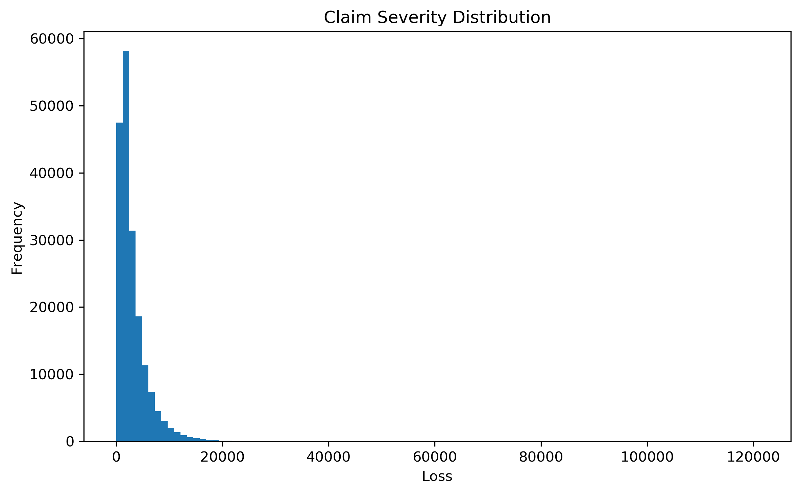
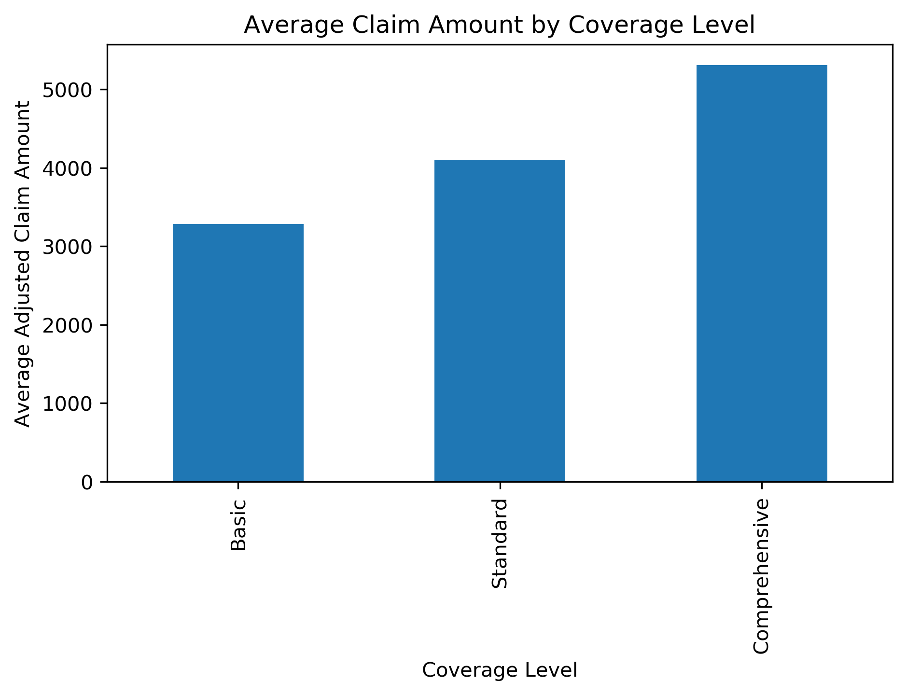
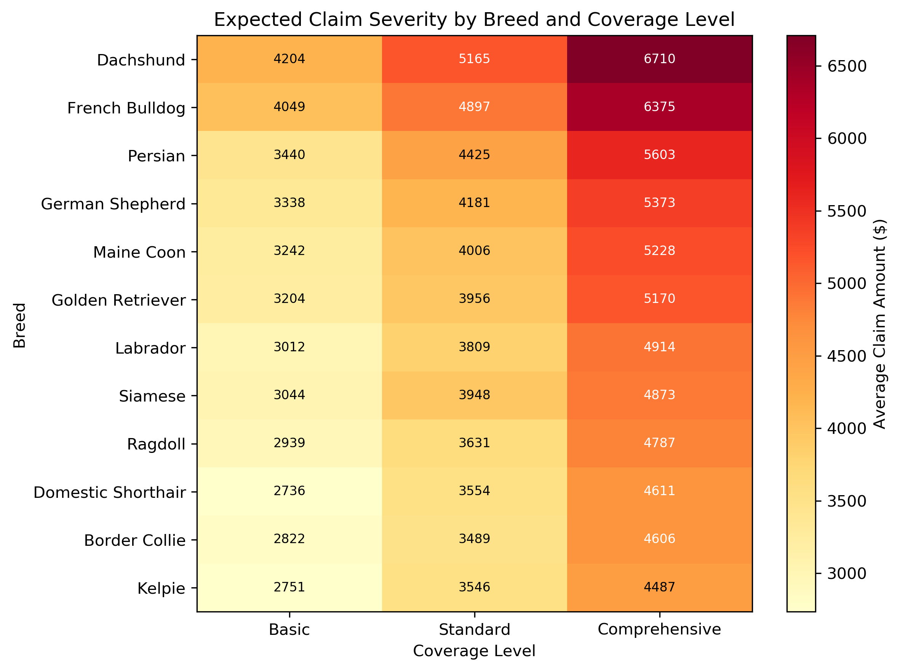
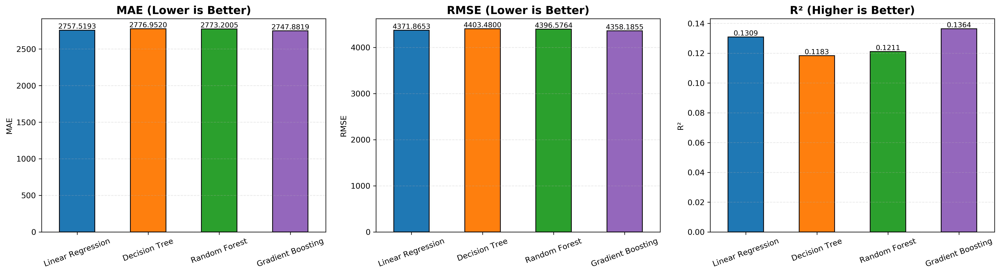
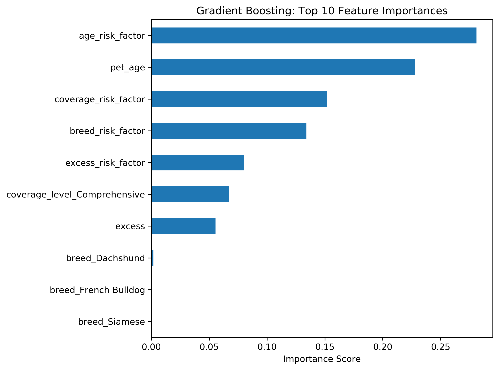

# 🐶 Pet Insurance Claims Risk Analytics

> End-to-end insurance analytics project using Python and Machine Learning to predict pet insurance claim severity and support pricing and underwriting decisions.


---

## Project Overview

This project analyses over 188,000 synthetic pet insurance claims to identify the major drivers of claim severity and develop predictive models that support insurance pricing and underwriting decisions.

The project follows a complete analytics workflow:

- Data exploration
- Feature engineering
- Risk segmentation
- Predictive modelling
- Business recommendations

---

## Technologies

| Category | Tools |
|----------|------|
| Programming | Python |
| Data Analysis | Pandas, NumPy |
| Visualization | Matplotlib |
| Machine Learning | Scikit-learn |
| Development | Jupyter Notebook |
| Version Control | GitHub |

---

## Project Structure

```
pet-insurance-claims-risk-analytics/

├── images/
├── notebooks/
├── reports/
```

---

## Analysis Workflow

### 01 Dataset Exploration

- Data quality assessment
- Missing value inspection
- Claim severity distribution
- Exploratory analysis

---

### 02 Feature Engineering

Creation of insurance pricing variables:

- Age Risk Factor
- Breed Risk Factor
- Coverage Risk Factor
- Excess Risk Factor

---

### 03 Risk Segmentation

Business analysis including:

- Coverage level comparison
- Breed risk analysis
- Risk heatmap

---

### 04 Predictive Modelling

Four regression models were evaluated:

- Linear Regression
- Decision Tree
- Random Forest
- Gradient Boosting

Evaluation metrics:

- MAE
- RMSE
- R²

Gradient Boosting achieved the strongest overall performance.

---

### 05 Business Insights

Final recommendations covering:

- Pricing strategy
- Underwriting optimisation
- Risk segmentation
- Portfolio management

---

## Key Findings

- Older pets generate significantly higher expected claim amounts.
- Comprehensive policies consistently produce the highest claim severity.
- Breed-specific risk remains an important pricing factor.
- Gradient Boosting delivered the best predictive performance.

---

## Model Performance

Four regression models were compared.

| Model | MAE | RMSE | R² |
|------|------:|------:|------:|
| Linear Regression | 2757.5 | 4371.9 | 0.1309 |
| Decision Tree | 2777.0 | 4403.5 | 0.1183 |
| Random Forest | 2773.2 | 4396.6 | 0.1211 |
| **Gradient Boosting** | **2747.9** | **4358.2** | **0.1364** |

Gradient Boosting achieved the strongest predictive performance across all evaluation metrics.

---

## Example Visualisations

### Claim Severity Distribution



---

### Coverage Level Comparison



---

### Breed × Coverage Risk Matrix



---

### Model Performance Comparison



---

### Top Feature Importance



---
## Author

**Yanjie Li**

Master of Actuarial Studies  
Australian National University

Interested in:

- Data Analytics
- Machine Learning
- Insurance Analytics
- Risk Modelling

LinkedIn (coming soon)
